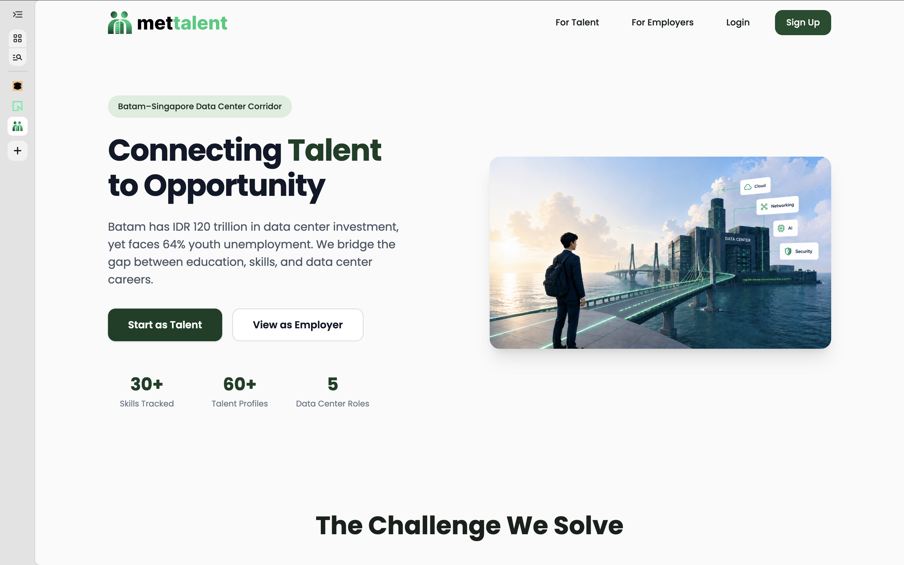
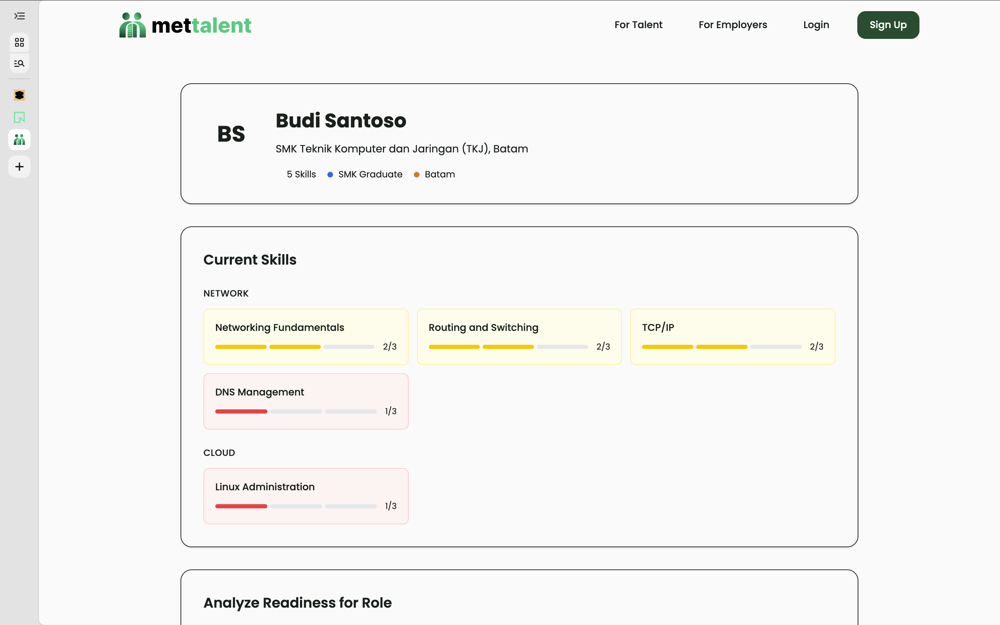
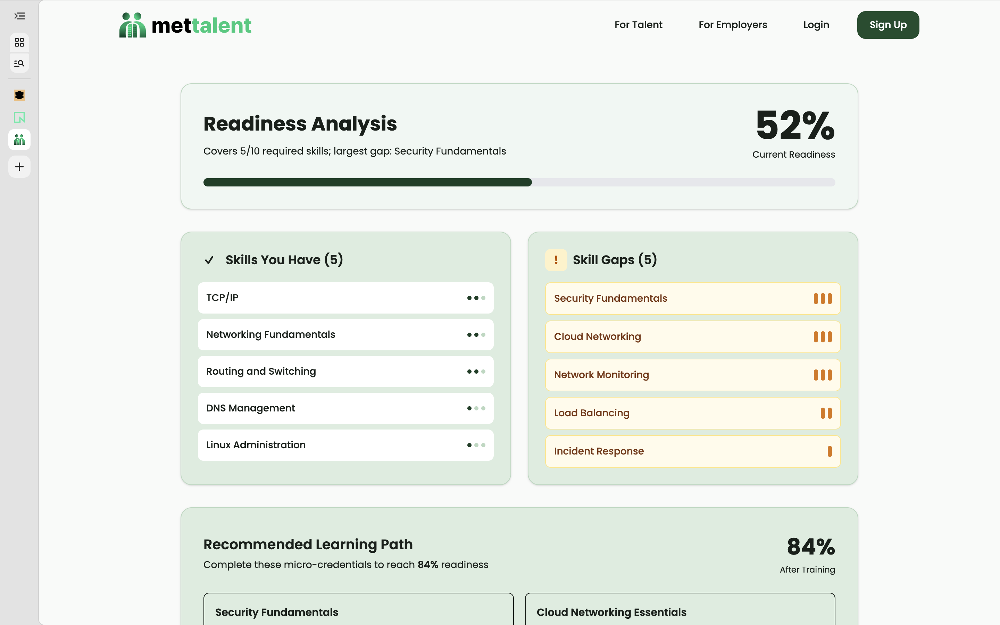
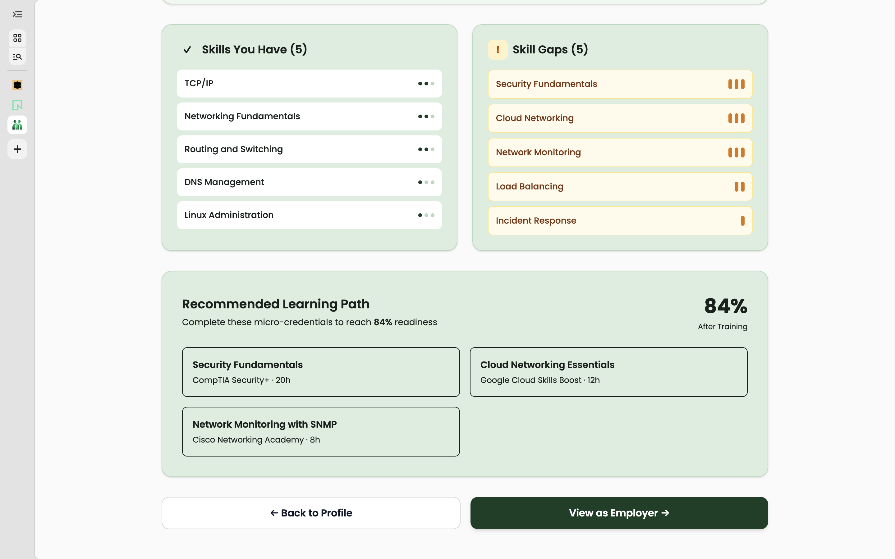
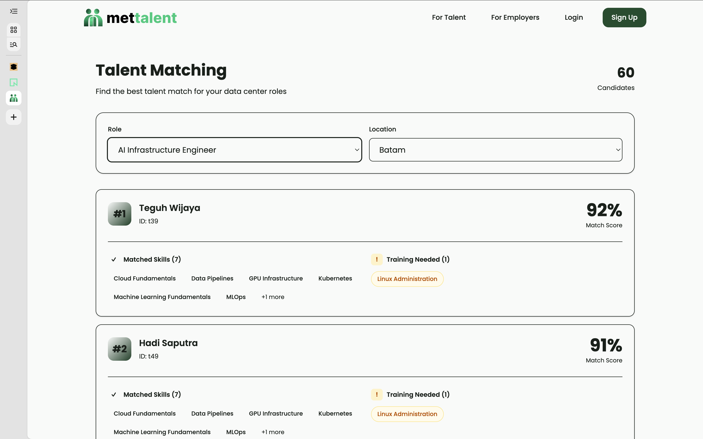

<div align="center">
  

  # mettalent

  A talent supply chain platform for the Batam–Singapore corridor. It profiles a candidate's skills, measures the gap against data center role requirements, recommends micro-credentials to close that gap, and matches ready candidates to real openings.

  **Batam Singapore Hackathon 2026 · Track 1 / Challenge 1: Talent Bridge**

  **Team Rollerblade** · Politeknik Negeri Batam
</div>

---



## The problem

Batam has drawn over IDR 120 trillion in data center investment yet remains the largest contributor to unemployment in Riau Islands, the province with Indonesia's second-highest unemployment rate. Around 64% of the unemployed hold only secondary-school qualifications, while the industry needs networking, cloud, AI, and security skills. Singapore, 45 minutes away by ferry, faces the same shortage. mettalent closes that gap. Sources and citations are in the problem-statement document.

## Features

- **Talent profile** (skills and education)
- **Skill gap engine**: readiness score and missing skills per data center role
- **Learning path**: micro-credential recommendations that close gaps
- **Matching** between talent and openings (Batam and Singapore)
- **Employer view**: ranked candidates per role

### Screenshots

#### Talent Profile


#### Skills Gap Analysis


#### Learning Path Recommendations


#### Employer Matching View


## Tech stack

| Layer | Technology |
| --- | --- |
| Frontend | React (Vite), Tailwind CSS, Framer Motion |
| Backend | Node.js, Express |
| ML | Cosine similarity (integrated in Node.js backend) |
| Database | PostgreSQL |
| Deploy | Vercel (Frontend + Backend), Neon (PostgreSQL) |

## Running locally

```bash
# Prerequisites: Node 20+, Python 3.11+, PostgreSQL 15+
# Copy .env.example to .env in each service and fill in the values.

# 1. Database
createdb mettalent
cd backend && npm install && npm run seed   # schema + seed

# 2. ML service
cd ml && pip install -r requirements.txt
uvicorn main:app --port 8000

# 3. Backend
cd backend && npm run dev          # :3000

# 4. Frontend
cd frontend && npm install && npm run dev   # :5173
```

**Live demo:** https://mettalent.org · **Demo video:** `<your-youtube-url-here>`

## Architecture

Frontend (React on Vercel) → Express API (Node.js on Vercel) → PostgreSQL (Neon). ML matching logic integrated directly in backend using cosine similarity algorithm. Every score is explainable with no black box.

## Disclosure

**AI tools.** This project was built with the help of Claude Code (Anthropic) during the hackathon window. The planning documents (problem statement, PRD, architecture) were drafted with Claude's assistance.

**ML models and libraries.** Custom cosine similarity implementation in Node.js. No external ML libraries or pre-trained models used.

**Dataset.** The seed data (skill taxonomy, role requirements, openings, courses, and talent profiles) was curated by the team before the event from public sources:

- Skill and role taxonomy: public data center certification standards (CDCP/CDCS from EPI, Uptime Institute, Cisco CCNA, CompTIA, CNCF).
- Company and job names: publicly announced Batam data center projects (for example DayOne, NeutraDC, Princeton Digital Group).
- Talent profiles: synthetic, created by the team for the demo, not real personal data.

**Pre-existing code.** Standard boilerplate from create-vite for React frontend setup and Express.js initialization for backend API. All business logic, UI components, database schema, and matching algorithms were written during the hackathon window.

## Team

**Team Rollerblade** - Politeknik Negeri Batam

- **Dhani Dzulkarnain** - Full Stack Developer & Team Lead
- **Kavita Juwita Ramida** - UI/UX Designer & Frontend Developer
- **Khairunnisa** - UI/UX Designer & Frontend Developer

## License

The team owns the work. Submission grants the Batam Innovation Center a license to showcase it and explore pilots, per the hackathon rules.
